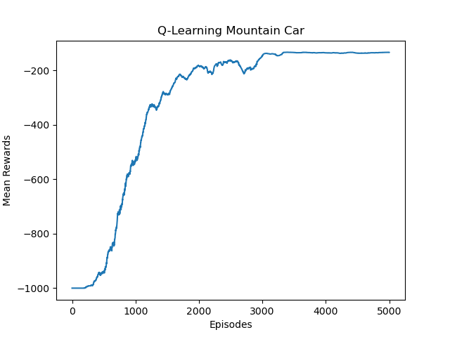
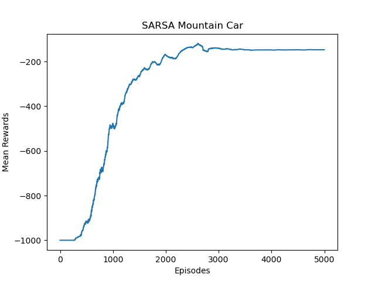

# MountainCar-v0 with Q-Learning and SARSA
---
This project contains the code to train an agent to solve the [Gymnasium Mountain Car environment](https://gymnasium.farama.org/environments/classic_control/mountain_car/) with Q-Learning and SARSA and and compare both.


### Observation Space:
The are two variables that determine the current state of the environment.
- The car position on the track, from -1.2 to 0.6
- The car velocity, from -0.07 to 0.07. Negative for left, and positive for right.

### Actions:
The car can take one of three different actions:
- Accelerate to the left
- Don't accelerate
- Accelerate to the right.

## Q-Learning
---
To train a new agent you can run the following line:
```
python3 QLearning.py
```
It will train for 5000 episodes, with the following hyperparameters:
- learning rate (alpha) = 0.1
- the temporal difference discount factor (gamma) = 0.99

  

## SARSA
---
To train a new agent you can run the following line:
```
python3 SARSA_mount_car.py
```
It will train for 5000 episodes, with the following hyperparameters:
- learning rate (alpha) = 0.1
- the temporal difference discount factor (gamma) = 0.99

  